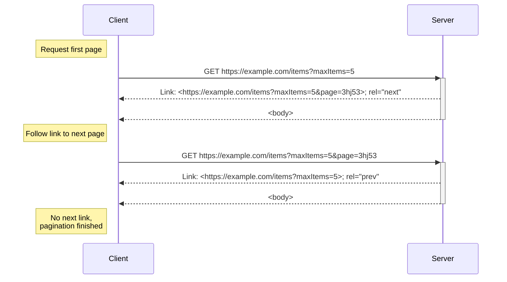

[](https://github.com/JoeReid/pagination/actions/workflows/go.yml)

# Pagination

API pagination is a ubiquitous feature and ocasionaly contraversial topic.

This repository provides an opinionated [Specification](SPECIFICATION.md) for performing pagination
along with a golang library for ease of implementation.

The [Specification](SPECIFICATION.md) also adresses the topic of backwards compatibility with other pagination
methods. The golang library also provides helpers for this.

## Usage

```go
middleware := pagination.NewMiddleware()

r := chi.NewRouter()

r.With(middleware).Get("/items", func(w http.ResponseWriter, r *http.Request) {
    fmt.Printf("request: maxItems=%d page=%q\n", pagination.MaxItems(r), pagination.Page(r))

    pagination.SetNext(r, "test") // dummy example token, replace with your own
    w.Write([]byte("...Data..."))
})

http.ListenAndServe(":8080", r)
```

## Pagination flow



See the [Specification](SPECIFICATION.md) for a full explanation.
