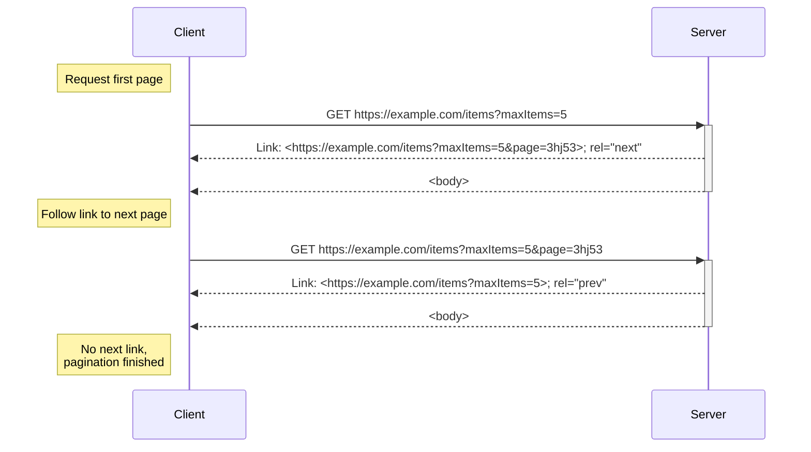
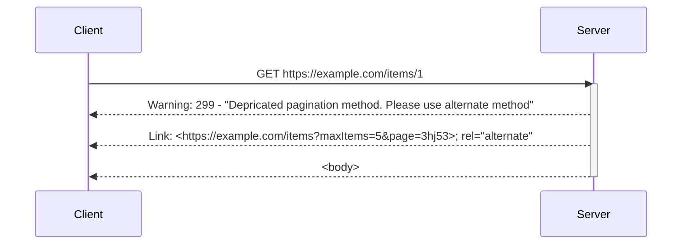

# Specification

## Definition of terms

This proposal uses key terms MUST, SHOULD and MAY along with their negations to define the requirements for compliant implementations.

- MUST is defined as a mandatory requirement.
- SHOULD is not mandatory, but it heavily recommended for all but edge cases.
- MAY is a looser, non-mandatory suggestion which my be applicable depending on usage.

## Quick Example

## Requests

The server MUST allow clients to control pagination using the URL query parameters `maxItems` and `page`.
The server MUST allow both of these parameters to be optional.
The server MUST treat a missing `page` parameter as a request for the first page of data.
The server MUST set a sane default value for `maxItems` if the client omits it.

Clients MUST only use values for the `page` parameter that have been provided by the server.
Clients MUST NOT try to interpret the symantic meaning of the `page` parameter.
The server SHOULD use opaque values for the `page` parameter. Numerical values are advised against for this reason.

## Responses

The server MUST NOT return more items in a response than the client provided `maxItems` or applicable defaults.
The server MAY return less than the requested ammount of items.
The server MUST return a link header with a `rel="next"` entry if there is more data available.
The server MUST set `maxItems` to the same value as the current request on `rel="next"` links.

The server MAY return a `rel="next"` link that, when de-referenced, returns no more data.
In this scenario the server MUST NOT include a `rel="next"` link in the subsequent request

Clients MUST interpret the absence of a `rel="next"` link to mean that there is no more data, and pagination has completed.

Servers MAY add `rel="prev"`, `rel="first"` and/or `rel="last"` link(s) to the response.

## Backwards compatibility

As server operators are often not in direct control over client code, pagination methods sometimes must maintain backwards compatibility with other aproaches.
For this purpose, server responses MAY violate this specification when handling a request that would previously have operated in an alternate manner.

Servers MUST add a warning header to any response where the specification has been violated due to backwards compatibility requirements.
This warning MUST use code `299`.
This warning MUST provide a message such as "Depricated pagination method. Please use alternate method".
This message MAY be internationalised via other methods such as the `Accept-Language` header.

Servers MUST add a link header with a `rel="alternate"` entry to any response where the specification has been violated due to backwards compatibility requirements.
This URL MUST be a URI representing a request for the same data as the current request in a manner compliant with the specification.

